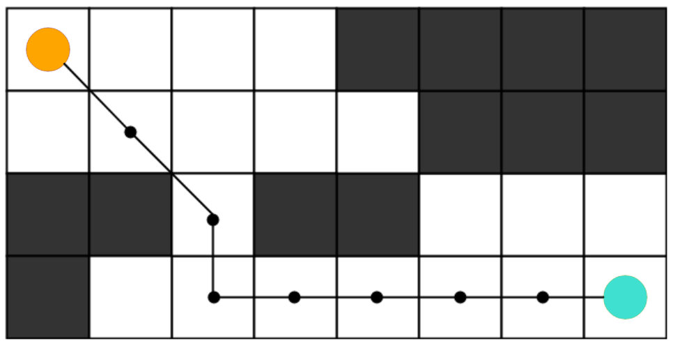

# Path Finder
Path finder using A* algorithm in JavaScript and Python :D

# What is A* Path Finding Algorithm ?
The `A* algorithm` is used for the most approximate path in world problems such as maps and games where they can be very short. I can consider a 2D grid that has an obstacle. The search task in this network starts from the source cell (colored in orange) to reach the target (colored in cyan). Search algorithm A* is one of the best and most popular methods used in routing and graph navigation.

 

 

# How A* algorithm works ?
A square grid with many obstacles is assumed. Also, one house is considered as the starting house and one house is considered as the destination house. The user wants to start from the starting house (if possible) and reach the destination house as quickly as possible. Here, the A* search algorithm comes into play.

 

Let `G = (V, E)` be a weighted graph, where `V` is the set of nodes (or vertices) and `E` is the set of edges connecting the nodes. Let s be the start node and t be the goal node. Let `h(n)` be the heuristic function that estimates the cost of the cheapest path from node `n` to the goal node `t`.

The A* algorithm searches for a path from the start node `s` to the goal node `s` that minimizes the function `f(n)`, which is defined as:

``f(n) = g(n) + h(n)``

where ``g(n)`` is the cost of the path from the start node ``s`` to node ``n``.

The algorithm maintains two lists: an open list and a closed list. The open list contains nodes that have been discovered but not yet explored, while the closed list contains nodes that have been explored.

Initially, the open list contains only the start node s with ``f(s) = g(s) + h(s)``. The algorithm then repeatedly selects the node with the lowest f-value from the open list and expands it by considering its neighbors. For each neighbor, the algorithm computes its f-value and updates its parent and g-value if a better path is found.

If the goal node ``t`` is reached, the algorithm terminates and returns the path from ``s`` to `t`. Otherwise, if the open list is empty, the algorithm concludes that there is no path from ``s`` to ``t``